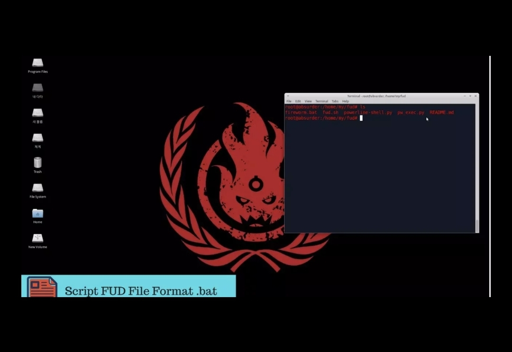

<div id="top"></div>
<!--
*** Thanks for checking out the Best-README-Template. If you have a suggestion
*** that would make this better, please fork the repo and create a pull request
*** or simply open an issue with the tag "enhancement".
*** Don't forget to give the project a star!
*** Thanks again! Now go create something AMAZING! :D
-->


<!-- PROJECT SHIELDS -->
<!--
*** I'm using markdown "reference style" links for readability.
*** Reference links are enclosed in brackets [ ] instead of parentheses ( ).
*** See the bottom of this document for the declaration of the reference variables
*** for contributors-url, forks-url, etc. This is an optional, concise syntax you may use.
*** https://www.markdownguide.org/basic-syntax/#reference-style-links
-->
[![Contributors][contributors-shield]][contributors-url]
[![Forks][forks-shield]][forks-url]
[![Stargazers][stars-shield]][stars-url]
[![Issues][issues-shield]][issues-url]
[![MIT License][license-shield]][license-url]
[![LinkedIn][linkedin-shield]][linkedin-url]


<!-- PROJECT LOGO -->
<br />
<div align="center">
  <a href="https://github.com/fireorb/FUD">
    
  </a>

<h3 align="center">FUD (Fully UnDetectable) for Windows Payload</h3>

  <p align="center">
    Bypasses 76% all modern antivirus 
    <br />
    <a href="https://github.com/fireorb/FUD"><strong>Explore the docs »</strong></a>
    <br />
    <br />
    <a href="https://youtu.be/Ej-m6N1jgts">View Demo</a>
    ·
    <a href="https://github.com/fireorb/FUD/issues">Report Bug</a>
    ·
    <a href="https://github.com/fireorb/FUD/issues">Request Feature</a>
  </p>
</div>


<!-- TABLE OF CONTENTS -->
<details>
  <summary>Table of Contents</summary>
  <ol>
    <li>
      <a href="#about-the-project">About The Project</a>
      <ul>
        <li><a href="#built-with">Built With</a></li>
      </ul>
    </li>
    <li>
      <a href="#getting-started">Getting Started</a>
      <ul>
        <li><a href="#installation">Installation</a></li>
      </ul>
    </li>
    <li><a href="#contact">Contact</a></li>
  </ol>
</details>


<!-- ABOUT THE PROJECT -->
## About The Project

[![Product Name Screen Shot][product-screenshot]](https://www.virustotal.com/gui/file/6c0cfa6bf583e3b0df7e4f4603375a0ae1bf39be2abab4173e7ba46f09d481f9/summary)
[![Product Name Screen Shot][product-screenshot1]](https://www.virustotal.com/gui/file/6c0cfa6bf583e3b0df7e4f4603375a0ae1bf39be2abab4173e7ba46f09d481f9/summary)
<p align="right">(<a href="#top">back to top</a>)</p>

### Watch the Video
[](https://youtu.be/hSw9xZ7jw1E)

### Built With

* [Bash](https://www.gnu.org/software/bash/)
* [Python](https://www.python.org/)

<p align="right">(<a href="#top">back to top</a>)</p>


<!-- GETTING STARTED -->
## Getting Started

### Installation

1. Clone the repo
   ```sh
   git clone https://github.com/fireorb/FUD.git
   ```
2. Make to Execute
   ```sh
   cd FUD/ && chmod 777 fud.sh
   ```
4. Run
   ```sh
   sudo sh fud.sh
   ```

<p align="right">(<a href="#top">back to top</a>)</p>


<!-- CONTACT -->
## Contact

Rizaldy Christoffel - [@RizaldyChristo1](https://twitter.com/RizaldyChristo1) - rizaldy@naver.com

Project Link: [https://github.com/fireorb/FUD](https://github.com/fireorb/FUD)

<p align="right">(<a href="#top">back to top</a>)</p>


<!-- MARKDOWN LINKS & IMAGES -->
<!-- https://www.markdownguide.org/basic-syntax/#reference-style-links -->
[contributors-shield]: https://img.shields.io/github/contributors/github_username/repo_name.svg?style=for-the-badge
[contributors-url]: https://github.com/fireorb/How-to-install-Webmin-on-Ubuntu-AWS/graphs/contributors
[forks-shield]: https://img.shields.io/github/forks/github_username/repo_name.svg?style=for-the-badge
[forks-url]: https://github.com/fireorb/How-to-install-Webmin-on-Ubuntu-AWS/network/members
[stars-shield]: https://img.shields.io/github/stars/github_username/repo_name.svg?style=for-the-badge
[stars-url]: https://github.com/fireorb/How-to-install-Webmin-on-Ubuntu-AWS/stargazers
[issues-shield]: https://img.shields.io/github/issues/github_username/repo_name.svg?style=for-the-badge
[issues-url]: https://github.com/fireorb/How-to-install-Webmin-on-Ubuntu-AWS/issues
[license-shield]: https://img.shields.io/github/license/github_username/repo_name.svg?style=for-the-badge
[license-url]: https://github.com/fireorb/How-to-install-Webmin-on-Ubuntu-AWS/blob/master/LICENSE.txt
[linkedin-shield]: https://img.shields.io/badge/-LinkedIn-black.svg?style=for-the-badge&logo=linkedin&colorB=555
[linkedin-url]: https://www.linkedin.com/in/rizaldy-christoffel-66b064162
[product-screenshot]: images/result.jpg
[product-screenshot1]: images/result1.jpg
